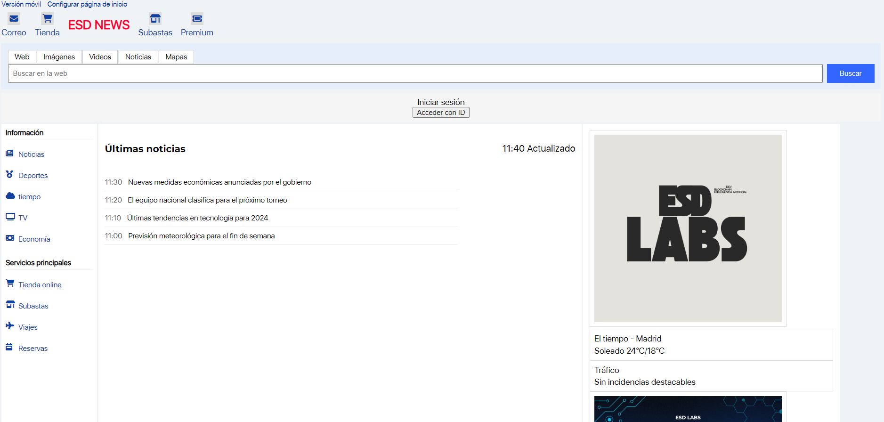

## Japanese Design Web Template

This is a simple HTML/CSS template for a news website, inspired by the design of Yahoo Japan.

Esto es una simple plantilla HTML/CSS para una página enfocada en noticias. Inspirada en el diseño de Yahoo Japonés.

## Preview

## Features

-  Diseño Responsivo
- Header con logo, menu de navegacion, y barra de búsqueda
-  Aréa de contenido principal con noticias
- Sidebar con lo más leído (o lo que nos interese) y categorías.
- Footer con enlaces e información relevante.

## Usage

1. Clona el repositorio:
2. Abre `index.html` en tu navegador para ver la plantilla.
3. Personaliza el HTML y CSS según tus necesidades o gustos.

## Contributing

If you find any issues or have suggestions for improvements, feel free to open a new issue or submit a pull request.

Si encuentras algún fallo o tienes sugerencias para mejorar el proyecto, eres libre de abrir un nuevo issue o mandar un pull request.

